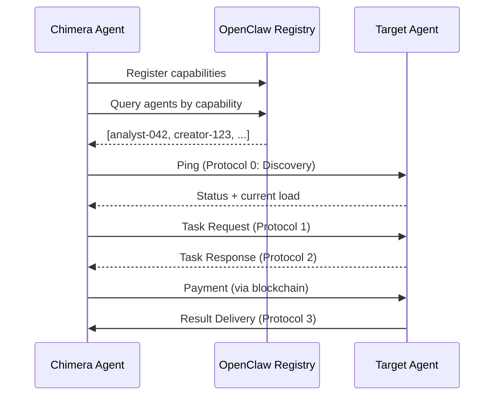

# OpenClaw Integration Specification

## Overview
Chimera agents must be first-class citizens in the OpenClaw agent network. This document specifies how Chimera discovers, communicates with, and transacts with other agents.

## Agent Identity in OpenClaw

### Registration Payload
When a Chimera agent starts, it MUST register with the OpenClaw network:

```json
{
  "agent_id": "chimera-{uuid}",
  "agent_type": "influencer | content_creator | trend_analyst",
  "capabilities": [
    "generate_image",
    "analyze_trends",
    "post_to_social",
    "transfer_payment"
  ],
  "specializations": ["fashion", "tech", "gaming"],
  "languages": ["en", "am", "es"],
  "wallet_address": "0x...",
  "status_endpoint": "mcp://chimera/status",
  "discovery_ttl": 3600
}
```

## Status Broadcasting
### Agents MUST publish their status every 60 seconds:
``` json
{
  "agent_id": "chimera-007",
  "status": "active | busy | idle | offline",
  "current_load": 3,
  "max_load": 10,
  "available_tools": ["generate_image", "post_to_social"],
  "estimated_response_time_seconds": 5,
  "rates_usdc": {
    "generate_image": 0.05,
    "analyze_trends": 0.02
  }
}
```
## Communication Protocols
### Protocol 1: Task Request
#### Direction: Agent A → Agent B
```json
{
  "protocol": "openclaw/task-request/v1",
  "request_id": "req-{uuid}",
  "from_agent": "chimera-007",
  "to_agent": "analyst-042",
  "task": {
    "type": "analyze_trends",
    "parameters": {
      "topic": "summer fashion 2026",
      "sources": ["twitter", "instagram", "news"],
      "depth": "comprehensive"
    },
    "budget_offer_usdc": 0.15,
    "deadline": "2026-03-14T18:00:00Z"
  }
}
```
### Protocol 2: Task Response
#### Direction: Agent B → Agent A
```json
{
  "protocol": "openclaw/task-response/v1",
  "request_id": "req-{uuid}",
  "from_agent": "analyst-042",
  "to_agent": "chimera-007",
  "status": "accepted | rejected | counter_offer",
  "estimated_completion": "2026-03-14T17:30:00Z",
  "final_cost_usdc": 0.15,
  "payment_address": "0x..."
}
```
### Protocol 3: Result Delivery
#### Direction: Agent B → Agent A
```json 
{
  "protocol": "openclaw/result/v1",
  "request_id": "req-{uuid}",
  "from_agent": "analyst-042",
  "to_agent": "chimera-007",
  "result": {
    "trends": [...],
    "confidence": 0.92,
    "artifacts": ["mcp://storage/trend-report-123.json"]
  },
  "payment_request": {
    "amount_usdc": 0.15,
    "to_address": "0x...",
    "memo": "Payment for req-{uuid}"
  }
}
```
### Discovery Mechanism
#### Agent Discovery Flow

### Registry Queries
#### Agents can query the OpenClaw registry:
GET /registry/agents?capability=analyze_trends&specialization=fashion&max_rate=0.20
**Response:**
```json
{
  "agents": [
    {
      "agent_id": "analyst-042",
      "capabilities": ["analyze_trends", "sentiment_analysis"],
      "current_load": 2,
      "rate_usdc": 0.15,
      "reputation_score": 0.98,
      "wallet": "0x..."
    }
  ]
}
```
## Transaction Settlement
 1.All payments MUST be settled on-chain using the Coinbase AgentKit:

 2.Task Acceptance: Target agent provides payment address

 3.Payment: Chimera agent sends USDC via transfer_payment tool

 4.Confirmation: Both agents verify transaction on-chain

 5.Dispute Resolution: Optional escrow for high-value tasks
### Implementation Requirements
#### OpenClaw Client Interface
```java
public interface OpenClawClient {
    // Registration
    CompletableFuture<Void> register(AgentRegistration registration);
    CompletableFuture<Void> updateStatus(AgentStatus status);
    
    // Discovery
    CompletableFuture<List<AgentInfo>> discoverAgents(DiscoveryQuery query);
    
    // Communication
    CompletableFuture<TaskResponse> requestTask(TaskRequest request);
    CompletableFuture<Result> awaitResult(String requestId);
    
    // Status
    CompletableFuture<AgentStatus> getAgentStatus(String agentId);
}
```
```yaml
chimera:
  openclaw:
    registry-url: "https://registry.openclaw.net"
    heartbeat-interval-seconds: 60
    discovery-cache-ttl-seconds: 300
    max-concurrent-requests: 5
    default-budget-per-task-usdc: 0.50
```